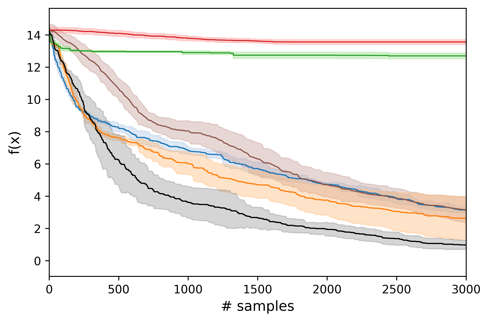
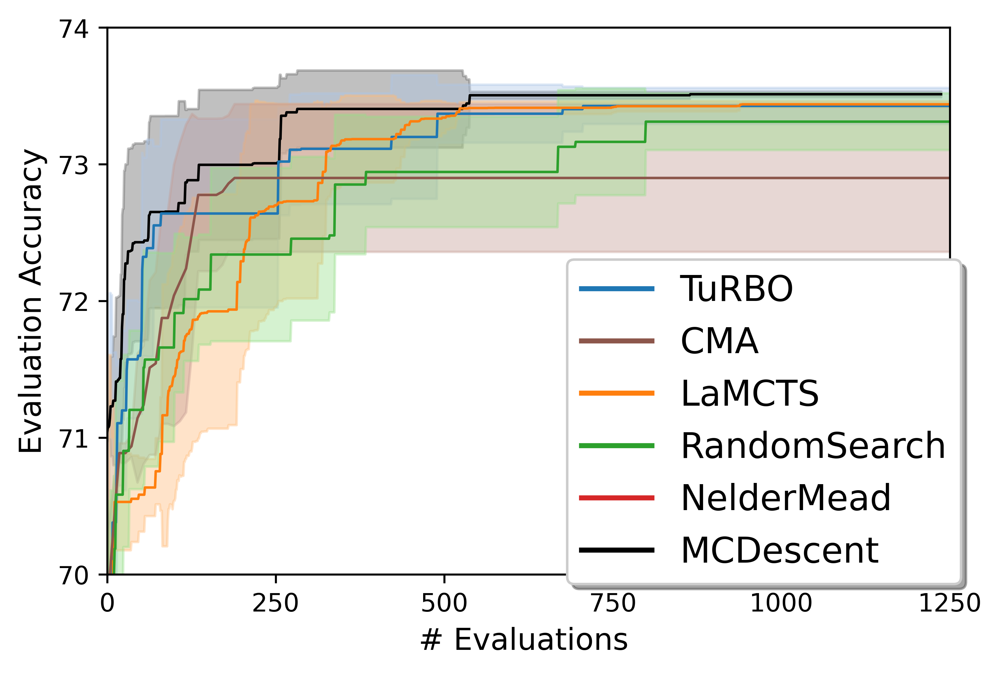

# Monte Carlo Tree Descent for Black-Box Optimization

The code here is the implementation of [Monte Carlo Tree Descent for Black-Box Optimization]

## Requirements

The notebook "MCDescent.ipynb" contains all codes that will reproduce the result in the paper.  
The notebook was tested and run on Google Colab with GPU acceleration support.  

If you want to run the notebook locally, you may still start by installing the requirements:

```
pip install -r requirements.txt
```


## Evaluation

To evaluate the model, simply run every cell in the notebook.  
Cells in the notebook are organized as follows:
* Package installation (for Google Colab)
* Model definition
* Test functions
* Evaluation runs


## Results

Here are the history of the best found value on the function of *Ackley-100d* (top) and *NAS-Bench-201 CIFAR-100* (bottom):




## Reference
Our model modifies the implementation of TuRBO [(source)](https://github.com/uber-research/TuRBO/blob/master/) and uses the implementation of some test functions from LaMCTS [(source)](https://github.com/facebookresearch/LaMCTS/blob/main/)

The copyright notices of two repos are also included. 

## Contributing
The submitted code is under MIT License.